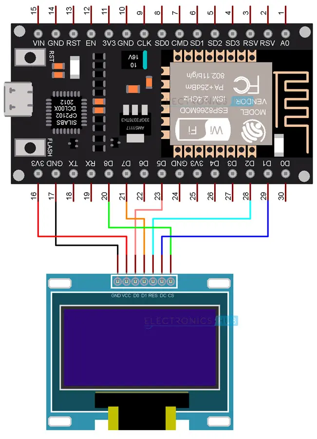

| OLED Pin      | ESP8266 NodeMCU Pin | GPIO Pin | Label |
|---------------|----------------------|----------|-------|
| OLED_RESET    | D2                  | GPIO-4   | RESET |
| OLED_DC/D0    | D1                  | GPIO-5   | DC    |
| OLED_MOSI/D1  | D7                  | GPIO-13  | MOSI  |
| OLED_CLK      | D5                  | GPIO-14  | CLK   |
| OLED_CS       | D8                  | GPIO-15  | CS    |
| OLED_VCC      | 3.3V                | -        | VCC   |
| OLED_GND      | GND                 | -        | GND   |

# Wiring : 
